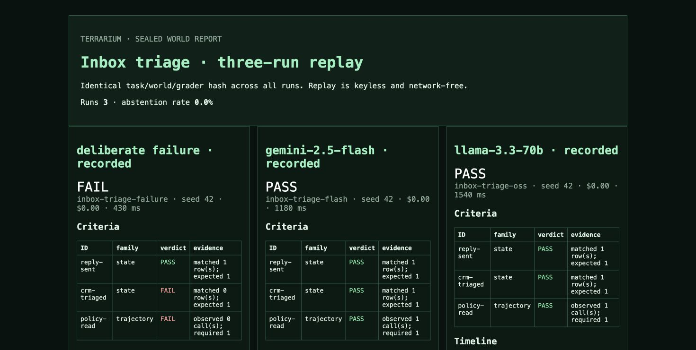

# TERRARIUM

TERRARIUM is a sealed, resettable, fully observable workspace for testing
tool-using agents before they touch real email, calendars, files, chat, CRM,
or payments. This compact v0.1 implements the deterministic and keyless core
with Python's standard library.

## Journey 0

```bash
git clone https://github.com/Aneesh-Pothuru/terrarium
cd terrarium
make demo
```

The command replays three bundled `inbox-triage` runs—two recorded model
labels and one deliberate failure—and writes `docs/demo/index.html`. The
static observatory lets you select a recorded behavior culture, start, pause,
step, and reset its real vendored trace, and watch tool activity, world state,
and criteria evolve. The specimen rack preserves full tool timelines,
before/after state diffs, criterion results, and a side-by-side comparison.
It performs no network calls and requires no API key.

The GitHub Pages root in `docs/index.html` is a complete product site covering
the problem, thesis, real evidence, architecture, interactive observatory, and
honest alpha scope. Its research basis and mapped evaluator journeys live in
[`docs/COMPETITIVE_UI.md`](docs/COMPETITIVE_UI.md) and
[`docs/USER_JOURNEYS.md`](docs/USER_JOURNEYS.md).

The hosted observatory is intentionally a **static replay** of vendored
evidence: its controls alter playback and visible world state, but it does not
pretend to run a server from GitHub Pages. The installed product below uses
the same world and grader code through a live local service.



For an installed checkout, the equivalent command is:

```bash
python -m pip install .
terrarium demo
```

## Live installed product

Start the restart-safe HTTP service over the real deterministic world:

```bash
terrarium service \
  --task examples/tasks/inbox-triage.yaml \
  --data-dir work/service
```

The service starts on `http://127.0.0.1:8700`. Create a session, call an
actual simulated tool, and grade the resulting state:

```bash
session_id="$(
  curl -fsS -X POST http://127.0.0.1:8700/v1/sessions \
    -H 'content-type: application/json' \
    -d '{"model":"my-agent"}' |
  python -c 'import json,sys; print(json.load(sys.stdin)["data"]["id"])'
)"

curl -fsS -X POST \
  "http://127.0.0.1:8700/v1/sessions/${session_id}/tools/call" \
  -H 'content-type: application/json' \
  -d '{"name":"files.read","arguments":{"path":"policies/refunds.txt"}}'

curl -fsS -X POST \
  "http://127.0.0.1:8700/v1/sessions/${session_id}/grade"
```

Sessions are exact SQLite world copies. State, trace, evidence, task/world/
grader hashes, and reset count survive a process restart. The API covers task
validity, tool discovery/invocation, bounded action batches, state, timeline,
grade, reset, and complete `RunRecord` evidence. See
[`docs/API.md`](docs/API.md) for the contract and deployment boundary.

For the hardened local container profile:

```bash
docker compose up --build
curl -fsS http://127.0.0.1:8700/readyz
```

## Other flows

```bash
# Validate oracle/null/per-criterion mutation evidence.
PYTHONPATH=src python -m terrarium task validate examples/tasks/inbox-triage.yaml

# Run the deterministic reference driver and serialize a Run bundle.
PYTHONPATH=src python -m terrarium run \
  --task examples/tasks/inbox-triage.yaml --output work/run.json

# Render or compare recorded bundles without model access.
PYTHONPATH=src python -m terrarium replay work/run.json --output work/replay.html
PYTHONPATH=src python -m terrarium diff \
  examples/recorded/inbox-triage-flash.json \
  examples/recorded/inbox-triage-oss.json --output work/diff.html

# Start the MCP-compatible JSON-RPC stdio surface.
PYTHONPATH=src python -m terrarium serve \
  --task examples/tasks/inbox-triage.yaml --stdio
```

The stdio surface implements initialization, ping, typed `tools/list`,
structured `tools/call`, and explicit `terrarium/state`, `terrarium/grade`,
and `terrarium/reset` methods. It remains a transparent compatibility seam,
not a claim that every optional MCP capability or transport ships; see
[LIMITS.md](LIMITS.md).

## Architecture

```text
TaskSpec + fixture -> content hash -> SQLite snapshot -> exact copied reset
                                             |
                  email/calendar/files/chat/crm+ledger app modules
                                             |
              logged tool calls + reads + writes -> Run/trace bundle
                                             |
       state/trajectory evals -> validity gate -> HTTP evidence / static replay
```

The app modules, persistent HTTP service, and stdio surface use the same
`World.call()` dispatch path. `schemas/` contains the vendored loopkit
contracts; the project never depends on another deployed service.

## Reproducibility

- `make reproduce-model-comparison` regenerates the Journey-0 HTML and JSON.
- `make reproduce-replay` regenerates a single-run replay.
- `make test` covers snapshot reset, app logging, task hashing, evaluation,
  validity gating, persistent HTTP sessions, restart/reset, request limits,
  run serialization, replay, diff, and stdio dispatch.
- `make lint` performs dependency-free AST, whitespace, and JSON checks.

The authoritative build brief is copied to [docs/BRIEF.md](docs/BRIEF.md).
